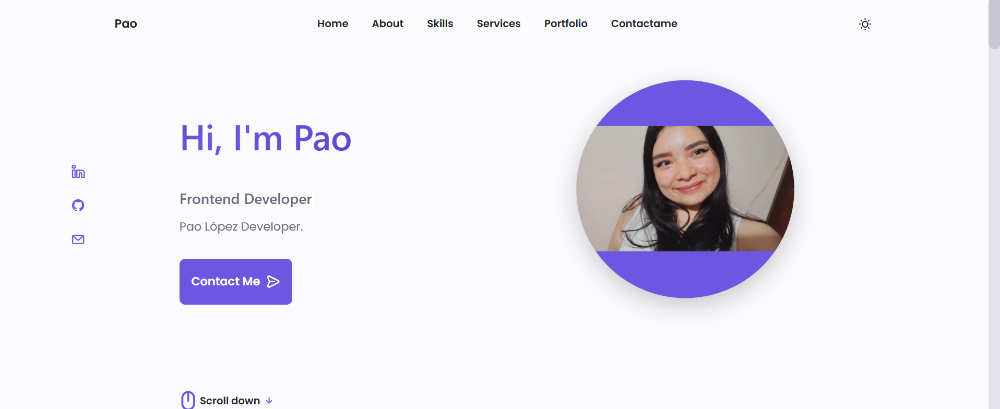
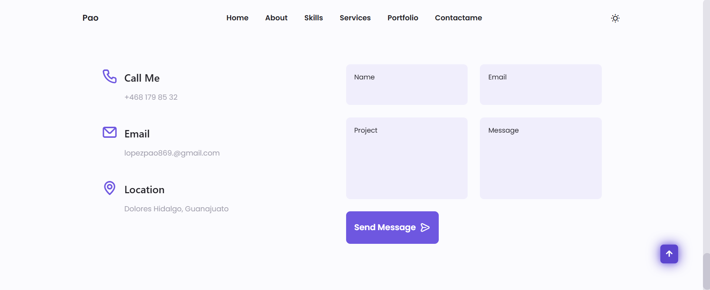
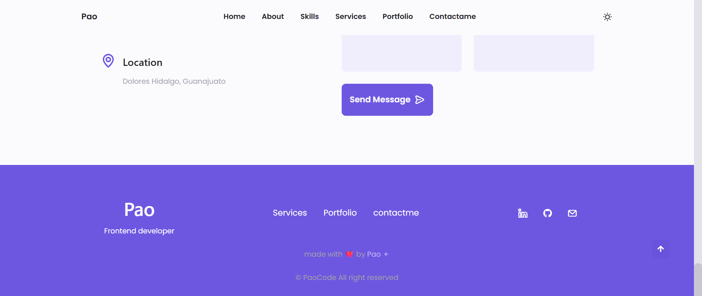
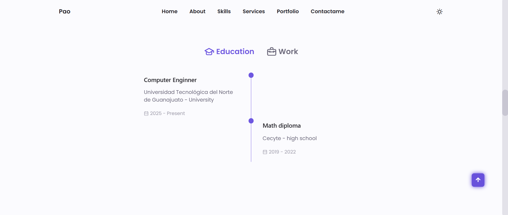

# Portafolio Profesional Web

## Nombre del estudiante

Paola Jaqueline López Mata

## Carrera

Ingeniería en Desarrollo y Gestión de Software

## Institución académica

Universidad Tecnológica del Norte de Guanajuato

---

# Objetivo de la práctica

El objetivo de esta práctica fue aprender el uso básico y profesional de Git y GitHub mediante la clonación, personalización y publicación de un proyecto web responsivo. Asimismo, se buscó comprender la estructura general de un proyecto de desarrollo web utilizando tecnologías como HTML, CSS y JavaScript.

---

# Descripción general del proyecto

El proyecto consiste en la adaptación de una plantilla web profesional obtenida desde un repositorio público de GitHub. La plantilla fue personalizada para convertirla en un portafolio profesional orientado al perfil académico y tecnológico del estudiante.

Durante el desarrollo de la práctica se modificaron distintos elementos visuales y estructurales del sitio web con el propósito de mejorar su presentación, personalización y apariencia profesional.

---

# Tecnologías utilizadas

- HTML5
- CSS3
- JavaScript
- Git
- GitHub
- Visual Studio Code
- Markdown

---

# Herramientas utilizadas

| Herramienta | Función |
|---|---|
| Git | Control de versiones |
| GitHub | Repositorio remoto |
| VS Code | Edición de código |
| Live Server | Ejecución local |
| GitLens | Visualización de cambios |
| Prettier | Formateo de código |

---

# Cambios realizados en el proyecto

## Personalización de información

- Cambio de nombre del desarrollador
- Modificación de profesión y descripción personal
- Actualización de información de contacto
- Integración de experiencia académica

## Personalización visual

- Cambio de colores principales
- Modificación de estilos y tipografía
- Adaptación de botones y secciones
- Incorporación de imágenes personalizadas

## Secciones agregadas

- Habilidades técnicas
- Tecnologías dominadas
- Formación académica
- Redes sociales
- Perfil profesional

## Diseño responsivo

Se realizaron pruebas de visualización en:

- Dispositivos móviles
- Tablets
- Equipos de escritorio

Con el propósito de verificar que el sitio mantuviera una correcta adaptación visual en diferentes resoluciones.

---

# Comandos Git utilizados

bash
git clone
git status
git add .
git commit
git push
git pull
git branch
git remote

---

# Flujo de trabajo realizado

1. Creación de carpeta de trabajo
2. Clonación del repositorio original
3. Apertura del proyecto en Visual Studio Code
4. Ejecución del sitio con Live Server
5. Análisis de la estructura del proyecto
6. Personalización del sitio web

---

# Habilidades desarrolladas

Durante esta práctica se fortalecieron conocimientos relacionados con:

- Desarrollo web
- Estructura HTML
- Diseño CSS
- Manipulación básica de JavaScript
- Uso de Git
- Administración de repositorios remotos
- Documentación técnica con Markdown
- Publicación de proyectos web

---

# Evidencias solicitadas

Las evidencias generadas durante la práctica incluyen:

1. Captura del repositorio clonado

3. Captura del sitio personalizado

4. Captura del archivo README_ESTUDIANTE.md

6. URL del repositorio GitHub
https://github.com/PaolaLpez/Portfolio-Website.git

---

# Conclusión

La práctica permitió comprender el flujo básico de trabajo utilizado en entornos reales de desarrollo web. Además, se logró adquirir experiencia en el manejo de Git y GitHub para el control de versiones y publicación de proyectos.

La personalización del portafolio facilitó la aplicación de conocimientos relacionados con HTML, CSS y JavaScript, fortaleciendo habilidades técnicas importantes para el desarrollo profesional dentro del área de software y tecnologías web.

---
# Evidencias

## Captura 1

## Captura 2

## Captura 3

## Captura 4
